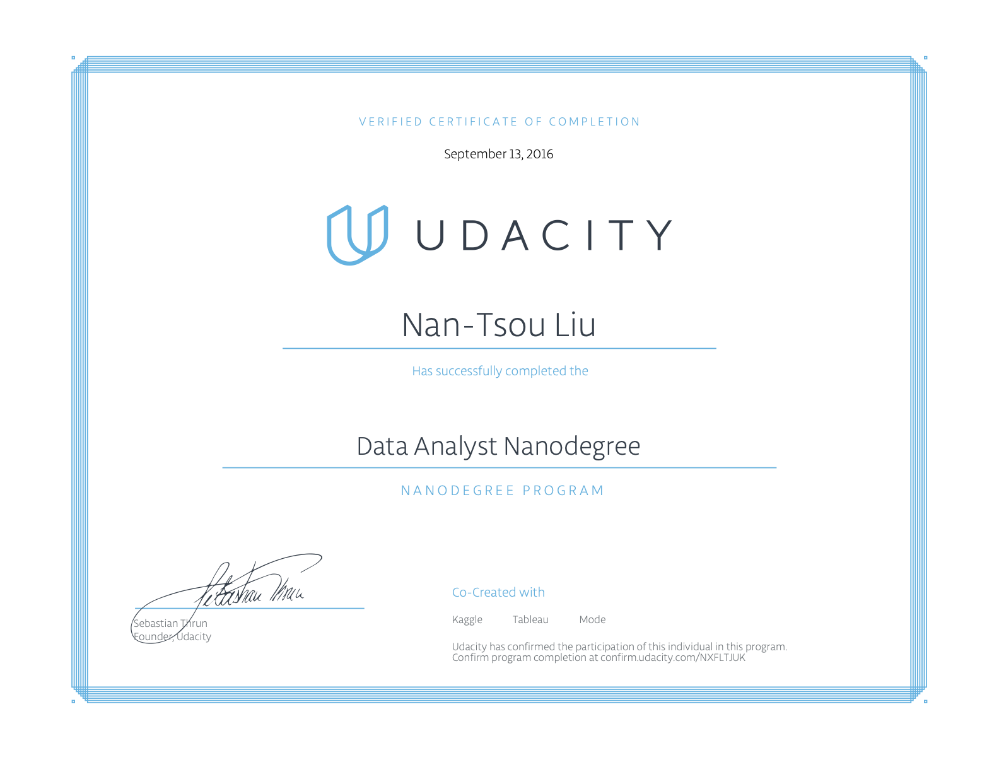

# Udacity: Data Analyst Nanodegree

## Completed projects

* P0: Analyze Chopstick Length
* P1: Test a Perceptual Phenomenon
* P2: Analyze the NYC Subway Dataset
* P3: Wrangle OpenStreetMap Data
* P4: Explore and Summarize Data
* P5: Identify Fraud from Enron Email
* P6: Make Effective Data Visualization
* P7: Design an A/B Test
